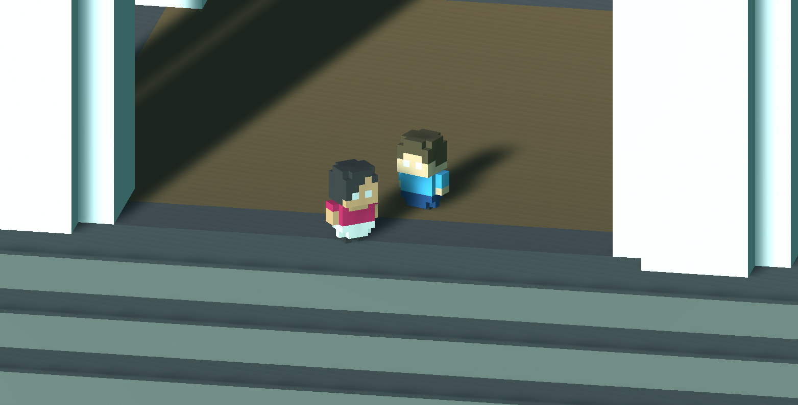

# Andrey and Li's Tiny Adventure

## [Play Game](https://andreybutenko.github.io/tinyadventure/) // [Watch Demo](https://www.youtube.com/watch?v=xwLgQxFs_8s&feature=youtu.be)

Tiny Unity game demonstrating:

- 3D models made with MagicaVoxel
- Navigation AI using Unity's built-in pathfinding features
- Keyboard and mouse input
